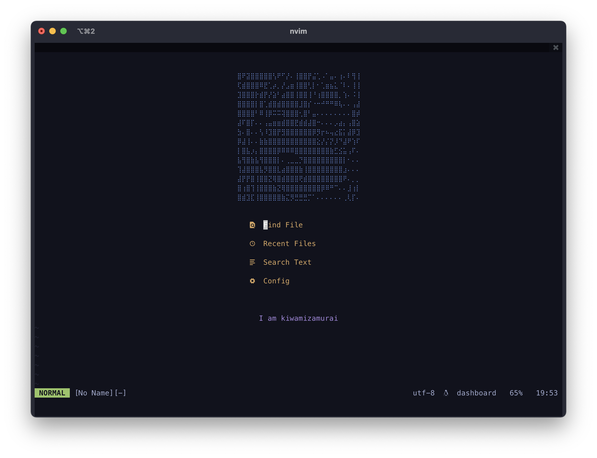

## Affiliation

<p align="center">
  
</p>

## Usage

```bash
/bin/bash -c "$(curl -fsSL https://raw.githubusercontent.com/kiwamizamurai/dotfiles/refs/heads/main/install.sh)"
```

## Status

[](https://github.com/kiwamizamurai/dotfiles/actions/workflows/macos.yml)
[](https://github.com/kiwamizamurai/dotfiles/actions/workflows/shellcheck.yml)

## misc

* [Wezterm](https://github.com/wez/wezterm) - Terminal
* [Starship](https://starship.rs/) - Shell Prompt
* [Zen-browser](https://zen-browser.app) - Browser

## Why Not Nix?

For simplicity and ease of maintenance. See [You don't have to use nix to manage your dotfiles](https://jade.fyi/blog/use-nix-less/)

## Repository Metrics

