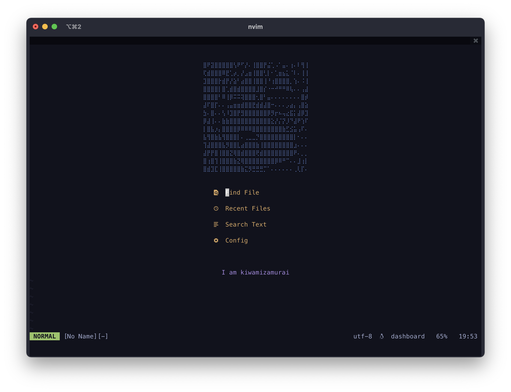

## Affiliation

  

## Status

## misc

* [wezterm](https://github.com/wez/wezterm) - Main Terminal
* [AeroSpace](https://github.com/nikitabobko/AeroSpace) - Window Manager
* [starship](https://starship.rs/) - Shell Prompt
* [zsh](https://www.zsh.org/) - Shell
* [neovim](https://neovim.io/) - As IDE

## Repository Metrics

