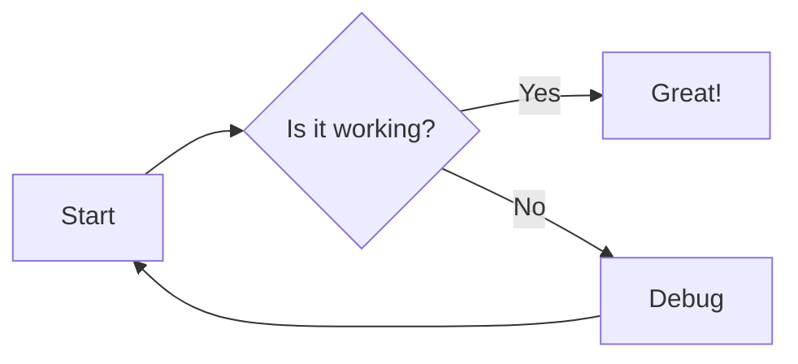

# Neovim Configuration Usage Guide

> A comprehensive guide for beginners to understand and use this Neovim configuration effectively.

## Table of Contents
- [Introduction](#introduction)
- [Basic Concepts](#basic-concepts)
- [Essential Keybindings](#essential-keybindings)
- [Plugin Guide](#plugin-guide)
- [Common Workflows](#common-workflows)
- [Troubleshooting](#troubleshooting)

---

## Introduction

This Neovim configuration is designed to provide a modern, efficient development environment. If you're new to Vim/Neovim, don't worry! This guide will walk you through everything you need to know.

### What is Neovim?
Neovim is a modern text editor based on Vim, designed for efficient text editing and programming. It uses keyboard shortcuts instead of mouse clicks, which makes it incredibly fast once you learn the basics.

### Understanding Vim Modes
Vim has different "modes" for different tasks:
- **Normal Mode** (default): For navigating and manipulating text
- **Insert Mode**: For typing text (like a regular editor)
- **Visual Mode**: For selecting text
- **Command Mode**: For running commands (starts with `:`)

**Key Tip**: Press `Esc` or type `jk`/`kj` quickly to return to Normal Mode from any other mode.

---

## Basic Concepts

### The Leader Key
The "Leader" key is a special modifier key used for custom shortcuts. In this configuration:
- **Leader Key = Space bar**
- Example: `<leader>e` means press Space, then press e

### Understanding Notation
- `<C-h>` = Ctrl + h
- `<S-Tab>` = Shift + Tab
- `<leader>` = Space bar
- `<CR>` = Enter key
- `:` = Command mode (press `:` in Normal mode)

---

## Essential Keybindings

### Mode Switching
| Keys | Action | Mode |
|------|--------|------|
| `i` | Enter Insert mode (start typing) | Normal → Insert |
| `jk` or `kj` | Exit to Normal mode | Insert → Normal |
| `Esc` | Exit to Normal mode | Any → Normal |
| `v` | Enter Visual mode (select text) | Normal → Visual |
| `:` | Enter Command mode | Normal → Command |

### Navigation
| Keys | Action | Where it works |
|------|--------|---------------|
| `h` / `j` / `k` / `l` | Move left/down/up/right | Normal mode |
| `gg` | Go to file beginning | Normal mode |
| `G` | Go to file end | Normal mode |
| `0` | Go to line beginning | Normal mode |
| `$` | Go to line end | Normal mode |
| `w` | Jump forward by word | Normal mode |
| `b` | Jump backward by word | Normal mode |

### Window Management
| Keys | Action |
|------|--------|
| `<C-h>` | Move to left window |
| `<C-l>` | Move to right window |
| `<C-j>` | Move to window below |
| `<C-k>` | Move to window above |
| `:split` | Split window horizontally |
| `:vsplit` | Split window vertically |

### Text Editing
| Keys | Action | Mode |
|------|--------|------|
| `dd` | Delete current line | Normal |
| `yy` | Copy current line | Normal |
| `p` | Paste after cursor | Normal |
| `u` | Undo last change | Normal |
| `<C-r>` | Redo | Normal |
| `>` | Indent selected text | Visual |
| `<` | Unindent selected text | Visual |

---

## Plugin Guide

### 1. **File Explorer (nvim-tree) 🌳**
*Visual file management with icons and Git integration*

```
┌──────────────────────────────────────────────────────────────┐
│  nvim-tree                                     Editor        │
│ ┌──────────────────────┐     ┌────────────────────────────┐ │
│ │ 📁 ~/project         │     │ index.js                   │ │
│ │  ├─ 📁 src           │     │                            │ │
│ │  │  ├─ 📄 index.js   │────▶│ const app = express();     │ │
│ │  │  ├─ 📄 api.js  ●  │     │ app.listen(3000);          │ │
│ │  │  └─ 📁 utils      │     │                            │ │
│ │  ├─ 📁 tests         │     │                            │ │
│ │  ├─ 📄 package.json  │     │ ● = Modified (git)         │ │
│ │  └─ 📄 README.md   + │     │ + = Untracked (git)        │ │
│ └──────────────────────┘     └────────────────────────────┘ │
│     Press <Space>+e                 Your code               │
└──────────────────────────────────────────────────────────────┘
```

| Shortcut | Action | Visual Feedback |
|----------|--------|-----------------|
| `Space + e` | Toggle file explorer | Slides in from left |
| `Enter` or `o` | Open file/folder | Opens in current window |
| `Ctrl+t` | Open in new tab | Opens file in new tab |
| `Ctrl+v` | Open in vertical split | Opens file in vertical split |
| `Ctrl+x` | Open in horizontal split | Opens file in horizontal split |
| `h` | Close folder / Go to parent | Navigate up in tree |
| `l` | Open folder / Open file | Navigate down / open |
| `a` | Create new file | Prompts for filename |
| `d` | Delete file | Confirmation dialog |
| `r` | Rename file | Inline rename mode |
| `x` | Cut file | Marks with dim color |
| `c` | Copy file | Shows copy indicator |
| `p` | Paste file | Pastes at cursor location |
| `R` | Refresh tree | Reloads file structure |
| `I` | Toggle hidden files | Shows/hides dotfiles |
| `H` | Toggle help | Shows all keybindings |

**Git Integration Indicators:**
- `●` Modified files (blue)
- `+` Untracked files (green)
- `✗` Deleted files (red)
- `➜` Renamed files (yellow)

**Pro Tips:**
- Press `g?` for complete keybinding help
- Use `W` to collapse all folders
- Press `-` to go up a directory
- Use `s` to open file in split

### 2. **Fuzzy Finder (telescope.nvim) 🔭**
*Powerful fuzzy finding with live preview*

```
┌──────────────────────────────────────────────────────────────┐
│ After pressing <Space>ff:                                   │
│ ┌────────────────────────────────────────────────────────┐  │
│ │ 🔍 Find Files                                          │  │
│ │ > ind                                                  │  │
│ ├────────────────────────────────────────────────────────┤  │
│ │   📄 src/index.js            ┃ Preview:               │  │
│ │   📄 tests/index.test.js  ◄──┃ import express from    │  │
│ │   📄 utils/findUser.js       ┃ 'express';             │  │
│ │   📄 api/index.ts            ┃ const app = express(); │  │
│ │   📄 docs/index.md           ┃                        │  │
│ ├────────────────────────────┴─┴────────────────────────┤  │
│ │ 5 / 1,847 files  <C-j/k> Navigate  <Enter> Open       │  │
│ └────────────────────────────────────────────────────────┘  │
└──────────────────────────────────────────────────────────────┘
```

| Shortcut | Action | Description |
|----------|--------|-------------|
| `Space + f + f` | Find files | Fuzzy search all project files |
| `Space + f + g` | Live grep | Search text content in all files |
| `Space + f + b` | Buffers | Browse open files |
| `Space + f + h` | Help tags | Search Neovim help |
| `Space + f + r` | Recent files | Previously opened files |
| `Space + f + d` | Diagnostics | Search errors/warnings |
| `Space + f + s` | Git status | Changed files in git |
| `Space + f + c` | Git commits | Browse commit history |

**Inside Telescope:**
```
┌─────────────────────────────────────┐
│ Navigation:                         │
│   Ctrl+j/k  = Move up/down         │
│   Ctrl+u/d  = Scroll preview       │
│   Tab       = Toggle selection     │
│   Ctrl+q    = Send to quickfix     │
│                                     │
│ Actions:                            │
│   Enter     = Open file            │
│   Ctrl+x    = Open in split        │
│   Ctrl+v    = Open in vsplit       │
│   Ctrl+t    = Open in new tab      │
│   Esc       = Close Telescope      │
└─────────────────────────────────────┘
```

**Advanced Search Patterns:**
- `'index` - Exact match (starts with ')
- `index$` - Files ending with "index"
- `!test` - Exclude files with "test"
- Fuzzy: `idxjs` matches `index.js`

### 3. **Code Completion (nvim-cmp + LuaSnip) 🚀**
*Intelligent autocompletion with snippets*

```
┌──────────────────────────────────────────────────────────────┐
│ As you type "con":                                          │
│                                                              │
│   con│                                                       │
│      ▼                                                       │
│ ┌─────────────────────────────────┐                        │
│ │ 🔤 const         [Keyword]      │ ← Tab to select        │
│ │ 📦 console       [Object]       │                        │
│ │ 🔨 constructor   [Function]     │                        │
│ │ 📝 continue      [Keyword]      │                        │
│ │ 🎯 config        [Variable]     │                        │
│ ├─────────────────────────────────┤                        │
│ │ const - declares a constant     │ ← Documentation        │
│ │ ES6 feature                     │                        │
│ └─────────────────────────────────┘                        │
│                                                              │
│ After selecting "console" and typing ".":                   │
│                                                              │
│   console.│                                                  │
│           ▼                                                  │
│ ┌─────────────────────────────────┐                        │
│ │ 📊 log()        Logs to console │                        │
│ │ ⚠️  warn()       Warning message │                        │
│ │ ❌ error()      Error message   │                        │
│ │ 📋 table()      Display table   │                        │
│ │ ⏱️  time()       Start timer     │                        │
│ └─────────────────────────────────┘                        │
└──────────────────────────────────────────────────────────────┘
```

| Shortcut | Action | When to Use |
|----------|--------|-------------|
| `Tab` | Next item / Expand snippet | Navigate down in menu |
| `Shift+Tab` | Previous item | Navigate up in menu |
| `Enter` | Accept completion | Insert selected item |
| `Ctrl+Space` | Trigger completion | Force menu to appear |
| `Ctrl+e` | Cancel completion | Close popup menu |
| `Ctrl+d` | Scroll docs up | Read previous documentation |
| `Ctrl+f` | Scroll docs down | Read more documentation |

**Snippet Example:**
```javascript
// Type "func" + Tab
func│ → function ${1:name}(${2:params}) {
          ${3:// body}
        }

// Type "for" + Tab
for│ → for (let ${1:i} = 0; ${1:i} < ${2:length}; ${1:i}++) {
         ${3:// body}
       }
```

**Completion Sources Icons:**
- `[LSP]` - Language server suggestions
- `[Buffer]` - Words from current file
- `[Path]` - File paths
- `[Snippet]` - Code snippets
- `[Calc]` - Calculator results

### 4. **Language Server Protocol (LSP + Mason) 🧠**
*IDE-like features powered by language servers*

```
┌──────────────────────────────────────────────────────────────┐
│ Hover Information (K):                                      │
│ ┌──────────────────────────────────────────────────────┐   │
│ │ express.Application                                   │   │
│ │                                                        │   │
│ │ Creates an Express application. The express()         │   │
│ │ function is a top-level function exported by the      │   │
│ │ Express module.                                        │   │
│ │                                                        │   │
│ │ @returns {Application} - Express application instance  │   │
│ └──────────────────────────────────────────────────────┘   │
│                                                              │
│ Error Diagnostics:                                          │
│   app.lisen(3000)                                           │
│       ~~~~~~ 🔴 Property 'lisen' does not exist.           │
│              Did you mean 'listen'?                         │
│                                                              │
│ Code Actions (<leader>ca):                                  │
│ ┌──────────────────────────────────────────┐               │
│ │ 💡 Quick Fix                             │               │
│ │   1. Change spelling to 'listen'         │               │
│ │   2. Add 'lisen' to dictionary           │               │
│ │   3. Import 'listen' from module         │               │
│ └──────────────────────────────────────────┘               │
└──────────────────────────────────────────────────────────────┘
```

| Shortcut | Action | What It Does |
|----------|--------|--------------|
| `gd` | Go to definition | Jump to where symbol is defined |
| `gD` | Go to declaration | Jump to declaration |
| `gr` | Find references | List all usages of symbol |
| `gi` | Go to implementation | Jump to implementation |
| `K` | Hover documentation | Show info popup |
| `<leader>rn` | Rename symbol | Rename across project |
| `<leader>ca` | Code actions | Show available fixes |
| `[d` | Previous diagnostic | Jump to previous error |
| `]d` | Next diagnostic | Jump to next error |
| `<leader>cf` | Format code | Auto-format current file |
| `gl` | Show diagnostic | Display error in float |

**Mason Package Manager:**
```
:Mason - Opens package manager UI
┌─────────────────────────────────────┐
│ Installed Language Servers:         │
│   ✓ lua-language-server            │
│   ✓ typescript-language-server     │
│   ✓ pyright (Python)               │
│   ✓ rust-analyzer                  │
│   ✓ gopls (Go)                     │
│                                     │
│ [i] Install  [u] Update  [x] Remove │
└─────────────────────────────────────┘
```

**Diagnostic Symbols:**
- 🔴 Error - Must fix
- 🟡 Warning - Should fix
- 🔵 Info - Good to know
- 💡 Hint - Suggestion

### 5. **Git Integration (gitsigns.nvim + diffview) 🔀**
*Visual git status and inline blame*

```
┌──────────────────────────────────────────────────────────────┐
│ Git Signs in Editor:                                        │
│                                                              │
│  1│   function getData() {                                  │
│  2│     const url = 'api/users';                            │
│ +3│     const token = getAuthToken();  ← New line (green)   │
│ ~4│     return fetch(url, {            ← Modified (blue)    │
│  5│       method: 'GET',                                    │
│ -6│     // Old authentication method  ← Deleted (red)       │
│  7│     });                                                 │
│  8│   }                                                     │
│                                                              │
│ Inline Blame (current line):                                │
│ └─ John Doe, 2 days ago • Fix authentication flow          │
│                                                              │
│ Preview Hunk (<leader>hp):                                  │
│ ┌──────────────────────────────────────────────────────┐   │
│ │ @@ -2,3 +2,4 @@                                      │   │
│ │   const url = 'api/users';                          │   │
│ │ - return fetch(url);                                │   │
│ │ + const token = getAuthToken();                     │   │
│ │ + return fetch(url, {                               │   │
│ └──────────────────────────────────────────────────────┘   │
└──────────────────────────────────────────────────────────────┘
```

| Shortcut | Action | Description |
|----------|--------|-------------|
| `]c` | Next change | Jump to next git modification |
| `[c` | Previous change | Jump to previous git modification |
| `<leader>hp` | Preview hunk | Show diff in popup |
| `<leader>hs` | Stage hunk | Add change to staging |
| `<leader>hr` | Reset hunk | Discard local changes |
| `<leader>hS` | Stage buffer | Stage entire file |
| `<leader>hR` | Reset buffer | Discard all file changes |
| `<leader>hb` | Blame line | Show full commit info |
| `<leader>hu` | Undo stage | Unstage hunk |
| `<leader>hd` | Diff this | Show diff for current file |
| `<leader>hD` | Diff this ~ | Show diff against previous commit |
| `<leader>tb` | Toggle line blame | Toggle inline blame on/off |
| `<leader>td` | Toggle deleted | Show/hide deleted lines |
| `ih` | Select hunk | Text object for git hunk (visual/operator mode) |

**Git Signs Legend:**
```
│ +  New lines (green)
│ ~  Modified lines (blue)
│ -  Deleted lines (red)
│ ┊  Top deleted (thin red)
│ ‾  Bottom deleted (thin red)
```

**Diffview.nvim Commands:**
- `:DiffviewOpen` - Compare working tree with HEAD
- `:DiffviewFileHistory` - Browse file history
- `:DiffviewClose` - Close diff view

### 6. **Comments (Comment.nvim) 💬**
*Smart commenting with language awareness*

```
┌──────────────────────────────────────────────────────────────┐
│ Before gcc:                  After gcc:                     │
│   function test() {            // function test() {         │
│     return true;       →         // return true;            │
│   }                            // }                         │
│                                                              │
│ Visual Mode (V + gc):                                       │
│ ┌─────────────────┐          ┌──────────────────┐         │
│ │ Selected lines  │   gc     │ /* Selected      │         │
│ │ to comment      │ ────►    │  * lines         │         │
│ │ together        │          │  * to comment    │         │
│ └─────────────────┘          │  * together */   │         │
│                              └──────────────────┘         │
│                                                              │
│ Language-Aware Comments:                                    │
│   JavaScript: // or /* */                                   │
│   Python:     #                                             │
│   HTML:       <!-- -->                                      │
│   CSS:        /* */                                         │
│   Lua:        --                                            │
└──────────────────────────────────────────────────────────────┘
```

| Shortcut | Action | Example |
|----------|--------|---------|
| `gcc` | Toggle line comment | Comment/uncomment current line |
| `gbc` | Toggle block comment | Block style /* */ |
| `gc` + motion | Comment motion | `gc5j` = comment 5 lines down |
| `gc` (visual) | Comment selection | Select then `gc` |
| `gcap` | Comment paragraph | Comment entire paragraph |
| `gcA` | Add comment end of line | Append comment |
| `gco` | Comment line below | Add comment on next line |
| `gcO` | Comment line above | Add comment on previous line |

**Smart Features:**
- Detects file type automatically
- Preserves indentation
- Supports nested comments
- Works with multiple cursors
- JSX/TSX aware (uses {/* */})

### 7. **Terminal (toggleterm.nvim) 🖥️**
*Integrated terminal with multiple layouts*

```
┌──────────────────────────────────────────────────────────────┐
│ Horizontal Terminal (Ctrl+\):                               │
│ ┌──────────────────────────────────────────────────────┐   │
│ │ index.js                                             │   │
│ │ const app = express();                               │   │
│ │ app.listen(3000);                                    │   │
│ ├──────────────────────────────────────────────────────┤   │
│ │ Terminal #1                                          │   │
│ │ $ npm run dev                                        │   │
│ │ Server running on http://localhost:3000             │   │
│ │ $ █                                                  │   │
│ └──────────────────────────────────────────────────────┘   │
│                                                              │
│ Vertical Terminal:            Float Terminal:               │
│ ┌─────────┬──────────┐       ╔════════════════╗           │
│ │ Code    │ Terminal │       ║   Terminal     ║           │
│ │         │  $ git   │       ║   $ npm test   ║           │
│ │         │  status  │       ║   ✓ All pass   ║           │
│ └─────────┴──────────┘       ╚════════════════╝           │
└──────────────────────────────────────────────────────────────┘
```

| Shortcut | Action | Context |
|----------|--------|---------|
| `<C-\>` | Toggle terminal | Open/close terminal |
| `<C-\><C-n>` | Terminal normal mode | Navigate in terminal |
| `exit` or `<C-\>` | Close terminal | Exit terminal |
| `2<C-\>` | Open terminal #2 | Multiple terminals |
| `<C-h/j/k/l>` | Navigate windows | Move between splits |

**Terminal Directions:**
| Shortcut | Action |
|----------|--------|
| `<leader>th` | Horizontal terminal (bottom) |
| `<leader>tv` | Vertical terminal (right) |
| `<leader>tf` | Floating terminal (center) |
| `<leader>tl` | LazyGit (floating) |

**Advanced Features:**
- Persistent terminals across sessions
- Send commands to terminal
- Multiple terminal instances
- Custom terminal functions
- Lazygit integration available

### 8. **Status Line (lualine.nvim) 📊**
*Beautiful and informative status line*

```
┌──────────────────────────────────────────────────────────────┐
│                         Your Editor                         │
│                                                              │
│                      (main content area)                    │
│                                                              │
├──────────────────────────────────────────────────────────────┤
│ NORMAL │  main │  index.js │ utf-8 │ js │ 85% │ 42:15 │ │
└──────────────────────────────────────────────────────────────┘
    ↑        ↑         ↑         ↑      ↑    ↑      ↑     ↑
   Mode   Branch  Filename  Encoding Type Scroll Line  Diag

Detailed Breakdown:
┌────────────────────────────────────────────────────────────┐
│ A │        B         │       C       │        X    Y   Z  │
├───┼──────────────────┼───────────────┼────────────────────┤
│ 🟢│  main │  2↑3↓ │ 📄 index.js ✏️ │ JS │ 85%│42:15│2 1│
└───┴──────────────────┴───────────────┴────────────────────┘

Section A (Mode):
  🟢 NORMAL    🔵 INSERT    🟡 VISUAL    🔴 COMMAND

Section B (Git):
   main     Feature branch name
  2↑ 3↓     2 ahead, 3 behind remote
  [M]       Modified files indicator

Section C (File):
  📄 index.js   Current filename
  ✏️            Modified unsaved
  🔒           Read-only
  ➕           New file

Section X, Y, Z (Info):
  JavaScript  Language/FileType
  85%        Scroll position
  42:15      Line:Column
  2 1       Errors Warnings
```

**Mode Colors:**
- Normal: Green background
- Insert: Blue background
- Visual: Yellow background
- Replace: Red background
- Command: Purple background

**Status Icons:**
- `✏️` Modified file
- `✓` File saved
- `🔒` Read-only
- `⚡` LSP active
- `⚠️` Warnings present
- `❌` Errors present

### 9. **Tabs/Buffers (bufferline.nvim) 📑**
*Visual buffer management like browser tabs*

```
┌──────────────────────────────────────────────────────────────┐
│ ┌────────┬─────────┬──────────┬────────────┬───────────┐   │
│ │ 📄 main│ 🔵 api.js│ ● test.py│  README.md │ + config  │   │
│ └────────┴─────────┴──────────┴────────────┴───────────┘   │
│      ↑        ↑          ↑           ↑            ↑         │
│   Active  Inactive   Modified    Inactive    Has errors    │
│                                                              │
│ Pick Mode (:BufferLinePick):                                │
│ ┌────────┬─────────┬──────────┬────────────┬───────────┐   │
│ │   a    │    s    │     d     │      f     │     g     │   │
│ └────────┴─────────┴──────────┴────────────┴───────────┘   │
│             Press letter to jump to that buffer             │
│                                                              │
│ Diagnostic Indicators:                                      │
│   ● Modified (unsaved)                                      │
│   🔴 Has errors                                             │
│   🟡 Has warnings                                           │
│   ✓ LSP loaded                                              │
└──────────────────────────────────────────────────────────────┘
```

| Shortcut | Action | Description |
|----------|--------|-------------|
| `Tab` | Next buffer | Cycle forward |
| `Shift+Tab` | Previous buffer | Cycle backward |
| `:bn` | Next buffer | Alternative: `:bnext` |
| `:bp` | Previous buffer | Alternative: `:bprev` |
| `:bd` | Close buffer | Close current buffer |
| `:bd!` | Force close buffer | Close without saving |
| `:b <number>` | Go to buffer | Jump to specific buffer number |
| `:BufferLinePick` | Pick mode | Jump with letter |
| `gb` | Pick buffer | Alternative pick |
| `:BufferLineMovePrev` | Move left | Reorder tabs |
| `:BufferLineMoveNext` | Move right | Reorder tabs |

**Mouse Support:**
- Click tab to switch
- Middle click to close
- Scroll to cycle through

**Visual Indicators:**
- Current buffer: Highlighted background
- Modified: Dot indicator (●)
- Diagnostics: Error/warning counts
- File icons: Based on file type

### 10. **Syntax Highlighting (nvim-treesitter) 🌲**
*Advanced syntax understanding and manipulation*

```
┌──────────────────────────────────────────────────────────────┐
│ Regular Highlighting:        Treesitter Highlighting:       │
│ ┌────────────────────┐      ┌────────────────────┐        │
│ │ function getData() │      │ function getData() │        │
│ │   const url = api  │      │   const url = api  │        │
│ │   return fetch(url)│  VS  │   return fetch(url)│        │
│ │ }                  │      │ }                  │        │
│ └────────────────────┘      └────────────────────┘        │
│  Basic coloring only         Semantic understanding:       │
│                              - function is declaration     │
│                              - const is keyword            │
│                              - url is variable             │
│                              - fetch is function call      │
│                                                              │
│ Smart Selection (Incremental):                              │
│   cursor│ → word → expression → statement → block          │
│                                                              │
│ Folding Support:                                            │
│   function getData() {  ← za to fold                       │
│   ...                                                       │
│   }                                                         │
└──────────────────────────────────────────────────────────────┘
```

**Automatic Features:**
- Semantic highlighting based on code structure
- Rainbow parentheses (via rainbow-delimiters)
- Auto-close HTML/JSX tags (via nvim-ts-autotag)
- Smart indentation
- Syntax-aware text objects

**Text Objects (with Treesitter):**
| Keys | Selection |
|------|-----------|
| `vaf` | Around function |
| `vif` | Inside function |
| `vac` | Around class |
| `vic` | Inside class |
| `vai` | Around conditional |
| `vii` | Inside conditional |

**Commands:**
- `:TSInstall <language>` - Install parser
- `:TSUpdate` - Update all parsers
- `:TSInstallInfo` - Show installed parsers
- `:InspectTree` - View syntax tree

### 11. **Color Preview (nvim-colorizer) 🎨**
*Live color visualization in your code*

```
┌──────────────────────────────────────────────────────────────┐
│ Your CSS/Config File:                                       │
│                                                              │
│   .primary {                                                 │
│     background: #3B82F6;  ← [████] Shows blue box          │
│     color: rgb(255, 255, 255); ← [████] Shows white        │
│     border: 2px solid red; ← [████] Shows red              │
│   }                                                         │
│                                                              │
│   const theme = {                                           │
│     dark: '#1a1a1a',    ← [████] Shows dark gray          │
│     accent: hsl(280, 100%, 70%), ← [████] Shows purple    │
│     success: 'lightgreen', ← [████] Shows light green      │
│   }                                                         │
│                                                              │
│ Tailwind Classes:                                           │
│   <div class="bg-blue-500 text-white">                     │
│                   ↑           ↑                             │
│               [████]      [████]                           │
└──────────────────────────────────────────────────────────────┘
```

**Supported Formats:**
| Format | Example | Preview |
|--------|---------|---------|
| Hex | `#FF5733` | 🟧 |
| RGB | `rgb(255, 87, 51)` | 🟧 |
| RGBA | `rgba(255, 87, 51, 0.5)` | 🟧 (50%) |
| HSL | `hsl(14, 100%, 60%)` | 🟧 |
| Named | `tomato` | 🍅 |
| Tailwind | `bg-indigo-600` | 🟦 |

**Display Modes:**
- Background: Color as background
- Foreground: Color as text
- Virtual text: Color box after code

Works automatically - no configuration needed!

### 12. **Code Formatting (conform.nvim) ✨**
*Automatic code beautification*

```
┌──────────────────────────────────────────────────────────────┐
│ Before Format (<leader>cf):  After Format:                  │
│ ┌─────────────────────┐     ┌─────────────────────┐        │
│ │const data={         │     │const data = {       │        │
│ │name:"John",age:30,  │ --> │  name: "John",      │        │
│ │city:"NYC"}          │     │  age: 30,           │        │
│ │function test(){     │     │  city: "NYC"        │        │
│ │return true}         │     │};                   │        │
│ └─────────────────────┘     │                     │        │
│                              │function test() {    │        │
│   Messy, inconsistent       │  return true;       │        │
│                              │}                    │        │
│                              └─────────────────────┘        │
│                               Clean, consistent!            │
│                                                              │
│ Format on Save:                                             │
│   :w → Automatically formats before saving                  │
│                                                              │
│ Status Indicator:                                           │
│   ⚡ Formatting... → ✓ Formatted → 💾 Saved                │
└──────────────────────────────────────────────────────────────┘
```

| Feature | Languages | Formatter |
|---------|-----------|-----------|
| JavaScript/TypeScript | `.js .jsx .ts .tsx` | Prettier |
| Python | `.py` | Black + isort |
| Lua | `.lua` | Stylua |
| Go | `.go` | gofmt |
| Rust | `.rs` | rustfmt |
| JSON/YAML | `.json .yaml` | Prettier |
| HTML/CSS | `.html .css .scss` | Prettier |
| Markdown | `.md` | Prettier |
| Shell | `.sh .bash` | shfmt |

**Commands:**
- `<leader>cf` - Format current file
- `:ConformInfo` - Show active formatters
- Auto-format on save (enabled by default)

**Configuration Per Project:**
- `.prettierrc` - JavaScript/TypeScript settings
- `pyproject.toml` - Python settings
- `.stylua.toml` - Lua settings

### 13. **Dashboard (dashboard-nvim) 🏠**
*Beautiful startup screen with quick actions*

```
┌──────────────────────────────────────────────────────────────┐
│                                                              │
│                      ███╗   ██╗██╗   ██╗██╗███╗   ███╗     │
│                      ████╗  ██║██║   ██║██║████╗ ████║     │
│                      ██╔██╗ ██║██║   ██║██║██╔████╔██║     │
│                      ██║╚██╗██║╚██╗ ██╔╝██║██║╚██╔╝██║     │
│                      ██║ ╚████║ ╚████╔╝ ██║██║ ╚═╝ ██║     │
│                      ╚═╝  ╚═══╝  ╚═══╝  ╚═╝╚═╝     ╚═╝     │
│                                                              │
│                         Welcome back, User!                 │
│                     Neovim v0.11.5 | 22 plugins            │
│                                                              │
│                    [f] Find File        [SPC f f]          │
│                    [r] Recent Files     [SPC f r]          │
│                    [g] Find Text        [SPC f g]          │
│                    [c] Configuration    [SPC f c]          │
│                    [u] Update Plugins   [:Lazy update]     │
│                    [q] Quit             [:q]               │
│                                                              │
│                 Recent Projects:                            │
│                   1. ~/projects/website                     │
│                   2. ~/dotfiles                             │
│                   3. ~/work/api-server                      │
│                                                              │
│              💭 "Code is poetry written in logic"          │
└──────────────────────────────────────────────────────────────┘
```

**Quick Actions:**
| Key | Action | Command |
|-----|--------|---------|
| `f` | Find files | Opens Telescope |
| `r` | Recent files | Shows history |
| `g` | Grep text | Search in files |
| `c` | Config | Open init.lua |
| `u` | Update | Update plugins |
| `q` | Quit | Exit Neovim |

**Features:**
- Random programming quotes
- Recent files/projects
- Quick access to common tasks
- Session restoration
- Customizable ASCII art

### 14. **Which Key (which-key.nvim) 🗺️**
*Interactive command discovery and keybinding helper*

```
┌──────────────────────────────────────────────────────────────┐
│ After pressing <Space> (leader):                            │
│ ┌────────────────────────────────────────────────────────┐  │
│ │  → f  Find       [+] File operations                   │  │
│ │  → g  Git        [+] Version control                   │  │
│ │  → l  LSP        [+] Language features                 │  │
│ │  → s  Search     [+] Search operations                 │  │
│ │  → w  Window     [+] Window management                 │  │
│ │  → x  Trouble    [+] Diagnostics                       │  │
│ │  → h  Hunk       [+] Git changes                       │  │
│ │  → t  Terminal   [+] Terminal operations               │  │
│ │  → c  Code       [+] Code actions                      │  │
│ │                                                         │  │
│ │  Press key or wait for more...                         │  │
│ └────────────────────────────────────────────────────────┘  │
│                                                              │
│ After pressing <Space>f:                                    │
│ ┌────────────────────────────────────────────────────────┐  │
│ │  → f  Find Files      Search project files            │  │
│ │  → g  Grep Text       Search in file contents         │  │
│ │  → r  Recent Files    Previously opened files         │  │
│ │  → b  Buffers         Open buffers                    │  │
│ │  → h  Help            Search help docs                │  │
│ │  → c  Config          Open configuration              │  │
│ └────────────────────────────────────────────────────────┘  │
└──────────────────────────────────────────────────────────────┘
```

**How It Works:**
1. Press `<Space>` (leader key)
2. Wait ~500ms for popup
3. See available commands
4. Press next key to continue
5. Execute or see more options

**Key Groups:**
| Prefix | Category | Examples |
|--------|----------|----------|
| `<leader>f` | Find | Files, text, buffers |
| `<leader>g` | Git | Status, commits, branches |
| `<leader>l` | LSP | Format, rename, actions |
| `<leader>x` | Diagnostics | Errors, TODOs, trouble |
| `<leader>h` | Hunks | Git changes |
| `<leader>w` | Windows | Split, close, resize |

**Features:**
- Shows key descriptions
- Indicates key groups with `[+]`
- Updates dynamically based on context
- Shows custom keybindings
- Timeout configurable

### 15. **Autopairs (nvim-autopairs) 🔗**
*Smart bracket and quote completion*

```
┌──────────────────────────────────────────────────────────────┐
│ Auto-pairing in action:                                     │
│                                                              │
│   Type: (            Result: (|)          Cursor here ─┘    │
│   Type: {            Result: {|}                            │
│   Type: [            Result: [|]                            │
│   Type: "            Result: "|"                            │
│   Type: '            Result: '|'                            │
│   Type: `            Result: `|`                            │
│                                                              │
│ Smart behavior:                                             │
│   Before: func(|)   Type: )   After: func()|               │
│           └─ Skips over existing closing bracket           │
│                                                              │
│   Before: "|"       Type: "   After: ""|                   │
│           └─ Skips over existing quote                      │
│                                                              │
│ Fast wrap (Alt+e):                                          │
│   Before: |word     After: (word)                          │
│   Before: |phrase   After: "phrase"                        │
│                                                              │
│ Delete behavior:                                            │
│   Before: (|)       Backspace   After: |                   │
│           └─ Removes both brackets                          │
└──────────────────────────────────────────────────────────────┘
```

**Supported Pairs:**
| Language | Pairs |
|----------|-------|
| All | `()` `{}` `[]` `""` `''` ` `` ` |
| HTML/JSX | `<>` `<tag></tag>` |
| Markdown | ` ``` ` `***` `___` |
| Lua | `[[]]` |
| Python | `"""` `'''` |

**Smart Features:**
- Skip over closing pairs
- Delete both pairs at once
- Ignore pairs in comments
- Language-specific rules
- Works with nvim-cmp
- Fast wrap with Alt+e

### 16. **Indent Guides (indent-blankline.nvim) 📏**
*Visual indentation guides for better code structure*

```
┌──────────────────────────────────────────────────────────────┐
│ Without Indent Guides:       With Indent Guides:            │
│                                                              │
│ function main() {            function main() {              │
│   if (condition) {           │ if (condition) {             │
│     for (let i = 0) {        │ │ for (let i = 0) {        │
│       console.log(i);        │ │ │ console.log(i);        │
│       if (i > 5) {           │ │ │ if (i > 5) {           │
│         break;               │ │ │ │ break;               │
│       }                      │ │ │ }                      │
│     }                        │ │ }                        │
│   }                          │ }                            │
│ }                            }                              │
│                                                              │
│ Hard to track nesting!       Clear visual hierarchy!        │
│                                                              │
│ Rainbow Indents (with scope highlighting):                  │
│ ┌──────────────────────────────────────────┐               │
│ │ function process() {      ← Scope start  │               │
│ │ ╎ const data = [];                       │               │
│ │ ╎ items.forEach(item => {   ← New scope  │               │
│ │ ╎ ┊ if (item.valid) {       ← Deeper     │               │
│ │ ╎ ┊ ╎ data.push(item);                   │               │
│ │ ╎ ┊ }                                    │               │
│ │ ╎ });                                    │               │
│ │ }                          ← Scope end   │               │
│ └──────────────────────────────────────────┘               │
└──────────────────────────────────────────────────────────────┘
```

**Features:**
- Thin vertical lines at each indent level
- Different colors for nested scopes
- Highlights current indent level
- Shows scope boundaries
- Works with all languages

**Visual Indicators:**
```
│  Primary indent guide
┊  Secondary indent guide
╎  Inactive indent guide
▏  Current scope highlight
```

**Customization:**
- Automatically adapts to your indentation settings
- Respects tabs vs spaces
- Color-coded by depth
- Skips empty lines for cleaner look
- Special handling for comments

### 17. **Flash.nvim (Advanced Navigation) ⚡**
*Jump anywhere on screen with just 2 keystrokes*

```
┌─────────────────────────────────────────────────────┐
│ Before pressing 's':                               │
│                                                     │
│   function calculateTotal(items) {                 │
│     const sum = items.reduce((acc, item) => {     │
│       return acc + item.price;                     │
│     }, 0);                                         │
│     return sum * 1.08; // with tax                │
│   }                                                │
│                                                     │
├─────────────────────────────────────────────────────┤
│ After pressing 's' + 'ca':                         │
│                                                     │
│   function [a]calculateTotal(items) {              │
│     const sum = items.reduce((a[b]c, item) => {   │
│       return a[c]c + item.price;                   │
│     }, 0);                                         │
│     return sum * 1.08; // with tax                │
│   }                                                │
│       ↑ Press 'a', 'b', or 'c' to jump there!     │
└─────────────────────────────────────────────────────┘
```

| Shortcut | Action | Usage |
|----------|--------|-------|
| `s` | Flash Jump | Type 2 chars, then press highlighted letter |
| `S` | Treesitter Jump | Jump to code structures (functions, classes) |
| `r` (in operator mode) | Remote Flash | Use with d, y, c (e.g., `drs` + chars) |
| `R` | Treesitter Search | Search with structure awareness |

**Pro Tips:**
- `s` + 2 characters → Shows jump points with letters
- Works in Visual mode for quick selection
- Combines with operators: `ds` + 2 chars + label = delete to that point

### 18. **Harpoon (Quick File Navigation) 🎯**
*Bookmark your most used files for instant access*

```
┌─────────────────────────────────────────────────────┐
│           Your Harpoon'd Files                     │
│  ┌─────────────────────────────────────────┐      │
│  │ <Ctrl-e> opens this menu:               │      │
│  │                                          │      │
│  │  1. ~/project/src/index.js    <leader>1  │──────┼──► Instant jump!
│  │  2. ~/project/src/api.js      <leader>2  │──────┼──► No fuzzy finding!
│  │  3. ~/project/test/main.test  <leader>3  │──────┼──► Direct access!
│  │  4. ~/project/README.md       <leader>4  │──────┼──► Lightning fast!
│  │                                          │      │
│  │  [a]dd current file  [d]elete  [q]uit    │      │
│  └─────────────────────────────────────────┘      │
└─────────────────────────────────────────────────────┘
```

| Shortcut | Action | When to use |
|----------|--------|-------------|
| `<leader>ha` | Add current file to Harpoon | Mark important files |
| `<Ctrl-e>` | Open Harpoon menu | View/manage marked files |
| `<leader>1-4` | Jump to file 1-4 | Instant navigation |
| `<leader>hp` | Previous harpooned file | Cycle backwards |
| `<leader>hn` | Next harpooned file | Cycle forwards |

**Workflow Example:**
1. Open your main working files
2. Mark each with `<leader>ha`
3. Now jump between them instantly with `<leader>1`, `<leader>2`, etc.
4. No more `:bnext`, fuzzy finding, or file trees needed!

### 19. **Trouble.nvim (Beautiful Diagnostics) 🚦**
*A prettier way to view and navigate errors, warnings, and LSP results*

```
┌─────────────────────────────────────────────────────┐
│ Trouble - Diagnostics                         [x]  │
├─────────────────────────────────────────────────────┤
│ 🔴 Errors (2)                                      │
│   └─ src/index.js                                  │
│      ├─ line 42: 'userName' is not defined        │
│      └─ line 56: Missing semicolon                 │
│                                                     │
│ 🟡 Warnings (3)                                    │
│   ├─ src/api.js                                    │
│   │  └─ line 13: Unused variable 'oldData'        │
│   └─ src/utils.js                                  │
│      ├─ line 8: Function 'deprecated' is deprecated│
│      └─ line 22: Unreachable code detected         │
│                                                     │
│ 💡 Hints (1)                                        │
│   └─ src/config.js                                 │
│      └─ line 5: Consider using const instead       │
├─────────────────────────────────────────────────────┤
│ Press <CR> to jump, 'q' to close, 'r' to refresh  │
└─────────────────────────────────────────────────────┘
```

| Shortcut | Action | Description |
|----------|--------|-------------|
| `<leader>xx` | Toggle all diagnostics | Show all errors/warnings |
| `<leader>xX` | Buffer diagnostics only | Current file only |
| `<leader>cs` | Document symbols | Browse functions/classes |
| `<leader>cl` | LSP references/definitions | Code navigation |
| `<leader>xL` | Location list | Jump list items |
| `<leader>xQ` | Quickfix list | Quickfix items |

**Navigation in Trouble window:**
- `j`/`k` or `↓`/`↑` - Move between items
- `Enter` - Jump to location
- `o` - Jump and close Trouble
- `P` - Toggle preview
- `K` - Show item hover
- `q` or `Esc` - Close window

### 20. **Todo Comments (Highlight TODOs) 📝**
*Never miss a TODO, FIXME, or NOTE in your code*

```
┌─────────────────────────────────────────────────────┐
│ Your code with highlighted comments:               │
│                                                     │
│   // TODO: Add user authentication here            │
│   ───────  ← Highlighted in blue!                  │
│                                                     │
│   function processData() {                         │
│     // FIXME: This breaks with null values         │
│     ─────────  ← Highlighted in red!               │
│                                                     │
│     // HACK: Temporary workaround                  │
│     ────────  ← Highlighted in yellow!             │
│                                                     │
│     // NOTE: Performance could be improved         │
│     ────────  ← Highlighted in green!              │
│   }                                                │
└─────────────────────────────────────────────────────┘
```

**Supported Keywords & Colors:**
| Keyword | Alternatives | Color | Icon |
|---------|-------------|-------|------|
| `TODO` | | Blue | ` ` |
| `FIXME` | `FIX`, `BUG`, `FIXIT`, `ISSUE` | Red | ` ` |
| `HACK` | | Yellow | ` ` |
| `WARN` | `WARNING`, `XXX` | Orange | ` ` |
| `PERF` | `OPTIM`, `PERFORMANCE` | Purple | ` ` |
| `NOTE` | `INFO` | Green | ` ` |
| `TEST` | `TESTING`, `PASSED`, `FAILED` | Cyan | `⏲ ` |

| Shortcut | Action | Description |
|----------|--------|-------------|
| `]t` | Next TODO | Jump to next TODO comment |
| `[t` | Previous TODO | Jump to previous TODO |
| `<leader>xt` | TODOs in Trouble | View all TODOs in Trouble UI |
| `<leader>st` | Search TODOs | Find TODOs with Telescope |

**Pro Tips:**
- Comments are automatically highlighted - no setup needed!
- Works with `//`, `#`, `--`, `/* */` style comments
- Case-insensitive (todo, Todo, TODO all work)
- Pattern: `KEYWORD:` or `KEYWORD(name):` for assignments

### 21. **Noice.nvim + Notify (Modern UI) 🎨**
*Transform Neovim's UI into a modern, beautiful experience*

```
┌─────────────────────────────────────────────────────┐
│ Old Neovim:                                        │
│ ┌─────────────────────────────────────────┐        │
│ │:w                                        │ ← Bottom │
│ └─────────────────────────────────────────┘        │
│                                                     │
│ New with Noice.nvim:                              │
│            ┌─────────────────┐                     │
│            │  💾 :w          │ ← Centered popup!   │
│            └─────────────────┘                     │
│                                                     │
│ Notifications (top-right):        ┌──────────────┐ │
│                                   │ ✓ File saved  │ │
│                                   └──────────────┘ │
│                                          ↓         │
│                                   Fades out nicely │
└─────────────────────────────────────────────────────┘
```

**What's Different:**
| Feature | Before | After with Noice |
|---------|--------|------------------|
| Command line | Bottom of screen | Centered popup |
| Search | Bottom of screen | Stay at bottom (classic) |
| Messages | Bottom line | Notification popups |
| LSP progress | Status line only | Animated notifications |
| Errors | Bottom message | Pretty notification |
| Long messages | Truncated | Opens in split window |

**Notification Types & Icons:**
- ` ` ERROR - Red notifications
- ` ` WARN - Yellow notifications
- ` ` INFO - Blue notifications
- ` ` DEBUG - Gray notifications
- `✎` TRACE - Faint notifications

**No keybindings needed!** Works automatically. Features:
- Command input appears as you type
- Notifications slide in from the right
- Long messages automatically open in a readable split
- Search stays at the bottom (familiar behavior)
- LSP loading progress shows as notifications

**Tips:**
- `:messages` - View notification history
- `:Noice` - View message history in a nice buffer
- Notifications auto-dismiss after 3 seconds
- Critical errors stay longer

---

## Tab Management

Neovim tabs are separate workspaces (not like browser tabs - those are buffers).

| Command | Action | Description |
|---------|--------|-------------|
| `:tabnew` | New tab | Open a new empty tab |
| `:tabnew <file>` | New tab with file | Open file in new tab |
| `gt` | Next tab | Go to next tab |
| `gT` | Previous tab | Go to previous tab |
| `:tabc` or `:tabclose` | Close tab | Close current tab |
| `:tabo` or `:tabonly` | Close other tabs | Keep only current tab |
| `<number>gt` | Go to tab N | Jump to specific tab (e.g., `2gt`) |

**Note:** Diffview opens in a new tab. Use `:tabc` or `:DiffviewClose` to close it.

---

## Common Workflows

### Opening and Editing Files
1. Open Neovim: `nvim` or `nvim filename`
2. Press `Space + e` to open file explorer
3. Navigate with arrows or `j/k`
4. Press `Enter` to open a file
5. Press `i` to start editing
6. Make changes
7. Press `jk` to exit insert mode
8. Type `:w` to save or `:wq` to save and quit

### Searching in Project
1. Press `Space + f + g`
2. Type your search term
3. Navigate results with `<C-j>/<C-k>`
4. Press `Enter` to jump to result
5. Press `n` for next match, `N` for previous

### Working with Multiple Files
1. Open first file
2. `:vsplit filename` to open another file in split
3. Use `<C-h>/<C-l>` to switch between files
4. Or use `Space + f + f` to quickly open any file

### Quick Editing Tips
- `ciw` - Change word under cursor
- `ci"` - Change text inside quotes
- `da(` - Delete text including parentheses
- `vi{` - Select text inside curly braces
- `.` - Repeat last action

### Using Git
1. Make changes to files
2. See changes in gutter (colored lines)
3. `<leader>hp` to preview a change
4. `<leader>hs` to stage changes
5. Use terminal (`<C-\>`) to commit: `git commit -m "message"`

---

## Troubleshooting

### Common Issues and Solutions

**Q: How do I exit Neovim?**
A: Press `Esc` then type `:q` (or `:q!` to force quit without saving)

**Q: I can't type anything!**
A: You're probably in Normal mode. Press `i` to enter Insert mode.

**Q: My changes aren't saved!**
A: Use `:w` to save or `:wq` to save and quit.

**Q: Completion isn't working!**
A: Make sure you're in Insert mode and the language server is running. Check with `:LspInfo`

**Q: How do I update plugins?**
A: Type `:Lazy update` to update all plugins.

**Q: Terminal isn't working!**
A: Press `<C-\>` (Ctrl + backslash) to toggle terminal.

**Q: How do I learn more Vim commands?**
A: Run `:Tutor` for an interactive Vim tutorial!

---

## Tips for Beginners

1. **Start with basics**: Focus on navigation (`hjkl`) and mode switching first
2. **Learn incrementally**: Master 2-3 shortcuts per day
3. **Use the help**: `:help keyword` shows documentation
4. **Practice with vimtutor**: Run `vimtutor` in terminal
5. **Keep this guide handy**: Refer back when needed
6. **Use Which Key**: Press `Space` and wait to see available commands
7. **Don't memorize everything**: Learn what you use most

### Recommended Learning Path
1. Week 1: Basic navigation and editing
2. Week 2: File explorer and fuzzy finder
3. Week 3: Code completion and LSP features
4. Week 4: Git integration and advanced features

---

## Getting Help

- **Built-in help**: `:help` or `:help <topic>`
- **Check health**: `:checkhealth` to diagnose issues
- **Plugin help**: `:help <plugin-name>`
- **LSP status**: `:LspInfo` to check language servers
- **Lazy status**: `:Lazy` to manage plugins

---

## Quick Reference Card

### Most Used Daily Shortcuts
```
Navigation:         File Operations:      Editing:
Space+e  = Files    :w      = Save       i      = Insert
Space+ff = Find     :q      = Quit       dd     = Delete line
Space+fg = Search   :wq     = Save+Quit  yy     = Copy line
Tab      = Next     Space+e = Explorer   p      = Paste
s        = Flash    Space+ha= Harpoon add u      = Undo

Window:             Code:                Search:
Ctrl+h   = Left     gd    = Definition   /text  = Search
Ctrl+l   = Right    K     = Hover docs   n      = Next
Ctrl+j   = Down     Tab   = Complete     N      = Previous
Ctrl+k   = Up       gcc   = Comment      *      = Search word
Ctrl+e   = Harpoon  Space+cf = Format    ]t     = Next TODO

Modern Features:    Diagnostics:         Quick Access:
s        = Jump 2ch Space+xx = Errors    Space+1-4 = Harpoon files
S        = Tree jump Space+cs = Symbols   [t/]t   = Prev/Next TODO
Space+ha = Mark file Space+st = Find TODO Space+xt = TODO list
Ctrl+e   = Harpoon   Space+xX = Buf errs  Space+cl = LSP refs
```

### New Power Features (Added January 2025)
```
┌─────────────────────────────────────────────────────────────┐
│ FLASH NAVIGATION          │ HARPOON FILES                  │
│ s + 2 chars = Jump        │ <leader>ha = Add to Harpoon    │
│ S = Jump to structures    │ <Ctrl-e> = Harpoon menu        │
│ ds + chars = Delete to    │ <leader>1-4 = Jump to file 1-4 │
├───────────────────────────┼────────────────────────────────┤
│ TROUBLE DIAGNOSTICS       │ TODO COMMENTS                  │
│ <leader>xx = All errors   │ ]t = Next TODO                 │
│ <leader>xX = Buffer errs  │ [t = Previous TODO             │
│ <leader>cs = Symbols      │ <leader>xt = TODO in Trouble   │
│ <leader>cl = LSP info     │ <leader>st = Search TODOs      │
├───────────────────────────┴────────────────────────────────┤
│ MODERN UI: Commands appear centered, notifications slide   │
│ in from right, long messages open in splits automatically  │
└─────────────────────────────────────────────────────────────┘
```

Remember: The more you use it, the more natural it becomes. Don't try to learn everything at once!

---

## Automated Updates

This configuration includes automated update systems to keep your plugins and dependencies current.

### Plugin Update Automation

#### Automatic Weekly Updates
The repository has GitHub Actions configured to automatically check for plugin updates:

- **Schedule**: Every Sunday at 2:00 AM UTC
- **Process**: Creates a Pull Request with updates
- **Safety**: All updates require manual review before merging

#### Manual Update Methods

**1. Using the Update Script**
```bash
# Update all plugins (creates backup)
./scripts/update-plugins.sh update

# Check for updates without installing
./scripts/update-plugins.sh check

# Run health check
./scripts/update-plugins.sh health

# Restore from backup if something breaks
./scripts/update-plugins.sh restore
```

**2. Using Neovim Commands**
```vim
:Lazy update    " Update all plugins
:Lazy sync      " Sync plugins with lock file
:Lazy restore   " Restore from lock file
:Lazy check     " Check for updates
```

### Dependency Management

#### Dependabot
Automatically updates:
- GitHub Actions versions (weekly)
- Homebrew packages (monthly)

Pull requests are created automatically with:
- Clear description of changes
- Labels for easy filtering
- Grouped updates for better organization

#### Lock File (`lazy-lock.json`)
- Tracks exact versions of all plugins
- Ensures reproducible installations
- Committed to git for version control
- Allows rollback to previous states

### Backup System

**Automatic Backups**
- Created before every update
- Stored in `~/.config/nvim/backups/`
- Named with timestamp for easy identification

**Restoring from Backup**
```bash
# Using the script
./scripts/update-plugins.sh restore

# Manually
cp ~/.config/nvim/backups/lazy-lock.YYYYMMDD_HHMMSS.json \
   packages/nvim/.config/nvim/lazy-lock.json
nvim +Lazy restore
```

### Monitoring Updates

**GitHub Actions Status**
- Check Actions tab on GitHub repository
- Email notifications for failed updates
- Pull request notifications for available updates

**Local Checking**
```vim
:Lazy check    " In Neovim
```

### Update Workflow

1. **Automated Process** (GitHub Actions)
   - Runs weekly on Sunday
   - Updates plugins via lazy.nvim
   - Runs health checks
   - Creates PR if changes found
   - Assigns to you for review

2. **Manual Process** (Local)
   - Run update script
   - Review changes
   - Test functionality
   - Commit if satisfied

### Troubleshooting Updates

**If plugins break after update:**
1. Don't panic! Backups are available
2. Run: `./scripts/update-plugins.sh restore`
3. Or manually restore from `~/.config/nvim/backups/`
4. Report issues on plugin repositories

**If automated updates fail:**
1. Check GitHub Actions logs
2. Run manually: `./scripts/update-plugins.sh`
3. Review error messages
4. Fix conflicts if any

**Common Issues:**
- **Breaking changes**: Review plugin changelogs
- **Compatibility**: Ensure Neovim version meets requirements
- **API changes**: Update configuration as needed

### Best Practices

1. **Review PRs before merging** - Don't blindly accept updates
2. **Test locally first** - Pull PR branch and test
3. **Keep backups** - Script creates them automatically
4. **Read changelogs** - Especially for major version updates
5. **Pin versions if needed** - Use `tag` or `commit` in plugin spec

### Disabling Automation

If you prefer manual control:

**Disable GitHub Actions:**
1. Go to Settings → Actions → General
2. Disable workflows

**Disable Dependabot:**
1. Delete `.github/dependabot.yml`
2. Or comment out configurations

**Disable in Neovim:**
```lua
-- In plugins config
require("lazy").setup({
  checker = {
    enabled = false  -- Disable automatic checking
  }
})
```

## 🤖 Avante.nvim - AI-Powered Coding Assistant

### Overview
Avante.nvim provides a Cursor AI-like experience directly in Neovim, offering intelligent code suggestions, refactoring, and explanations powered by Claude, OpenAI, or other AI providers.

### API Key Setup (REQUIRED)

#### Option 1: Claude (Recommended)
```bash
# Add to ~/.zshrc or ~/.bashrc
export ANTHROPIC_API_KEY="your-claude-api-key-here"
```
Get your API key from: https://console.anthropic.com/settings/keys

#### Option 2: OpenAI
```bash
# Add to ~/.zshrc or ~/.bashrc
export OPENAI_API_KEY="your-openai-api-key-here"
```
Get your API key from: https://platform.openai.com/api-keys

#### Option 3: Scoped Keys (Isolated for Avante only)
```bash
# Avante-specific keys (won't affect other applications)
export AVANTE_ANTHROPIC_API_KEY="your-claude-api-key-here"
export AVANTE_OPENAI_API_KEY="your-openai-api-key-here"
```

**After adding keys, reload your shell:**
```bash
source ~/.zshrc  # or source ~/.bashrc
```

### Keybindings

| Keybinding | Description | Usage |
|------------|-------------|-------|
| `<leader>aa` | Ask AI | Ask questions about current code |
| `<leader>ae` | Edit with AI | Edit selected code with AI help |
| `<leader>ar` | Refresh | Refresh AI context |
| `<leader>at` | Toggle sidebar | Show/hide AI sidebar |
| `<leader>ac` | Clear chat | Clear conversation history |
| `<leader>af` | Focus sidebar | Focus on AI sidebar |
| `<leader>as` | Show cursor | Show cursor in sidebar |
| `<leader>an` | New chat | Start new conversation |
| `<leader>ah` | Switch provider | Switch between Claude/OpenAI |
| `<leader>a?` | Show providers | List available AI providers |

### AI Suggestions
| Keybinding | Description |
|------------|-------------|
| `Alt+l` | Accept suggestion |
| `Alt+]` | Next suggestion |
| `Alt+[` | Previous suggestion |
| `Ctrl+]` | Dismiss suggestion |

### Sidebar Controls
| Keybinding | Mode | Description |
|------------|------|-------------|
| `Enter` | Normal | Submit message |
| `Ctrl+s` | Insert | Submit message (while typing) |
| `Tab` | Any | Switch to next window in sidebar |
| `Shift+Tab` | Any | Switch to previous window in sidebar |
| `]]` | Any | Jump to next section |
| `[[` | Any | Jump to previous section |

### Basic Usage Examples

#### Ask AI About Code
1. Open any code file
2. Press `<leader>aa`
3. Type your question in the sidebar
4. Press `Ctrl+s` to submit (Insert mode) or `Esc` then `Enter` (Normal mode)

#### Edit Code with AI
1. Select code in visual mode (`v` + motion)
2. Press `<leader>ae`
3. Describe what changes you want
4. AI will suggest modifications

#### Apply AI Suggestions
- Press `a` to apply at cursor position
- Press `A` to apply all suggestions
- Use `]x` and `[x` to navigate between diff hunks

#### Switch AI Providers
```vim
:AvanteSwitchProvider openai  " Switch to OpenAI
:AvanteSwitchProvider claude  " Switch to Claude
```

### Zen Mode (Claude Code-like CLI)
```bash
# Add to ~/.zshrc for quick AI-focused Neovim
alias avante='nvim -c "lua vim.defer_fn(function()require(\"avante.api\").zen_mode()end, 100)"'
```

### Project-Specific Instructions
Create an `avante.md` file in your project root:
```markdown
# Project Instructions for AI

## Your Role
You are an expert developer working on [project name].

## Project Context
This is a [description] built with [technologies].

## Coding Standards
- Follow existing patterns
- Write comprehensive tests
```

### Integration with Claude Code CLI
- **Claude Code**: Project-wide refactoring, file creation
- **Avante.nvim**: In-editor assistance, quick edits

### Troubleshooting

#### API Key not found
1. Ensure API key is added to shell config
2. Run `source ~/.zshrc` or restart terminal
3. Restart Neovim

#### Build errors
```bash
cd ~/.local/share/nvim/lazy/avante.nvim
make clean && make
```

## 📝 Markdown Preview - Live Browser Preview

### Overview
**markdown-preview.nvim** provides real-time markdown preview in your browser with synchronized scrolling, math rendering, and diagram support.

### Features
- 🔄 Real-time preview updates as you type (no need to save)
- 📐 KaTeX support for math equations
- 🎨 Mermaid diagrams and flowcharts
- 🔗 Synchronized scrolling between editor and preview
- 🌙 Dark theme support
- 🏃 Fast refresh without page reload

### Usage

#### Open Preview
```vim
<leader>mp    " Toggle markdown preview in browser
```

Or use commands:
```vim
:MarkdownPreview        " Start preview
:MarkdownPreviewStop    " Stop preview
:MarkdownPreviewToggle  " Toggle preview
```

### Advanced Features

#### Math Equations
```markdown
Inline math: $\alpha + \beta = \gamma$

Block math:
$$
\int_{0}^{\infty} e^{-x^2} dx = \frac{\sqrt{\pi}}{2}
$$
```

#### Mermaid Diagrams
```markdown

```

### Tips
- Preview auto-closes when you leave the markdown buffer
- Use system default browser (configurable)
- Preview refreshes in real-time without saving
- Scroll position syncs between editor and preview

## 🪟 AeroSpace - i3-like Tiling Window Manager for macOS

### Overview
AeroSpace is a modern, i3-inspired tiling window manager that brings efficient keyboard-driven window management to macOS.

### Installation
```bash
# Install via Homebrew
brew install --cask nikitabobko/tap/aerospace

# Configuration is already symlinked if using dotfiles
# Manual symlink:
cd ~/hobby/dotfiles/packages
stow -t ~ aerospace
```

### Configuration
- **Start at login**: Disabled (manual startup)
- **Window gaps**: 5px between windows
- **Workspaces**: 9 persistent workspaces (1-9)
- **Default layout**: Tiles
- **Mouse behavior**: Follows focus

### Keybindings (All use Alt/Option key)

#### Window Navigation
| Keybinding | Action |
|------------|--------|
| `Alt+h` | Focus left |
| `Alt+j` | Focus down |
| `Alt+k` | Focus up |
| `Alt+l` | Focus right |

#### Window Movement
| Keybinding | Action |
|------------|--------|
| `Alt+Shift+h` | Move left |
| `Alt+Shift+j` | Move down |
| `Alt+Shift+k` | Move up |
| `Alt+Shift+l` | Move right |

#### Workspace Management
| Keybinding | Action |
|------------|--------|
| `Alt+1-9` | Switch to workspace 1-9 |
| `Alt+Shift+1-9` | Move window to workspace 1-9 |

#### Layout Control
| Keybinding | Action |
|------------|--------|
| `Alt+b` | Split horizontal |
| `Alt+v` | Split vertical |
| `Alt+f` | Toggle fullscreen |
| `Alt+s` | Stacking layout |
| `Alt+w` | Tabbed layout |
| `Alt+e` | Toggle split direction |
| `Alt+Shift+Space` | Toggle floating |

#### Window Resizing
| Keybinding | Action |
|------------|--------|
| `Alt+r` | Enter resize mode |
| In resize: `h/j/k/l` | Resize by 50px |
| In resize: `Shift+h/j/k/l` | Resize by 10px |
| In resize: `Enter/Esc` | Exit resize mode |

#### Other Commands
| Keybinding | Action |
|------------|--------|
| `Alt+Enter` | Open WezTerm |
| `Alt+Shift+q` | Close window |
| `Alt+Shift+b` | Balance sizes |
| `Alt+Shift+c` | Reload config |

### Starting AeroSpace
Since auto-start is disabled:
1. **Spotlight**: `Cmd+Space`, type "AeroSpace"
2. **Terminal**: `open -a AeroSpace`
3. **Alfred/Raycast**: Search "AeroSpace"

### Floating Windows
Auto-float by default:
- Finder
- System Settings
- Preview

### Quick Commands
```bash
# Check if running
pgrep -x AeroSpace

# View configuration
aerospace config

# List workspaces
aerospace list-workspaces

# Test config
aerospace config-test
```

### Tips
- Hold `Alt` for quick workspace switching
- Use `F3` (Mission Control) as fallback
- `Alt+r` then `Shift+hjkl` for precise resizing

---

*Last updated: January 2025 | Neovim v0.11.5 | Automation v1.0*